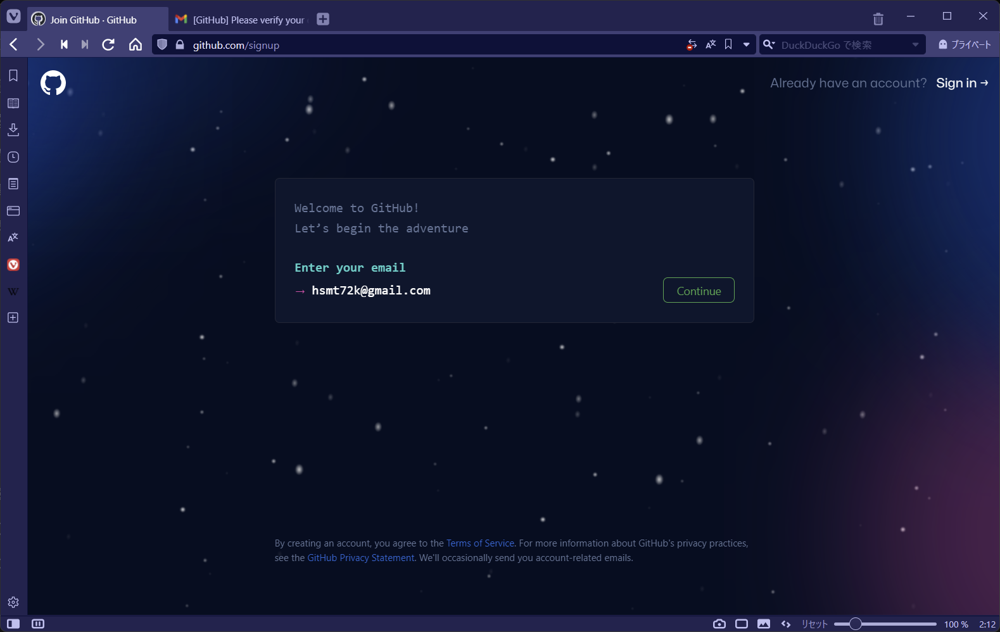
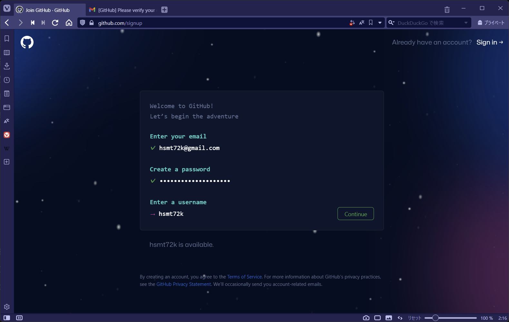
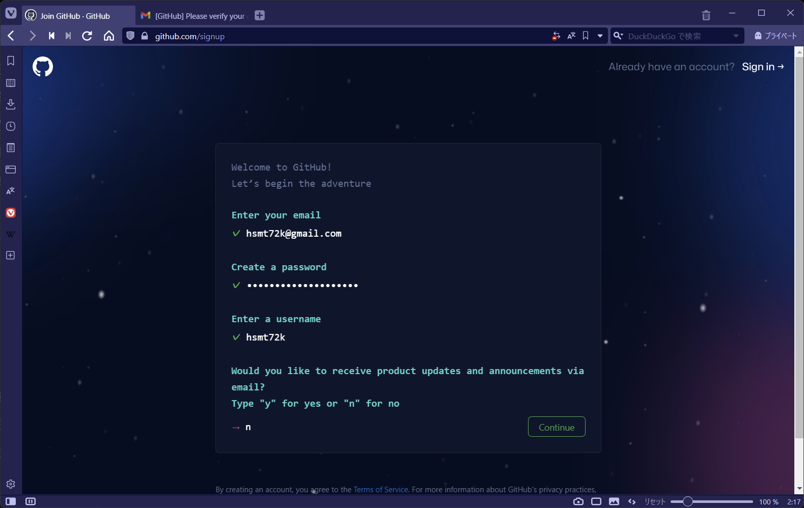
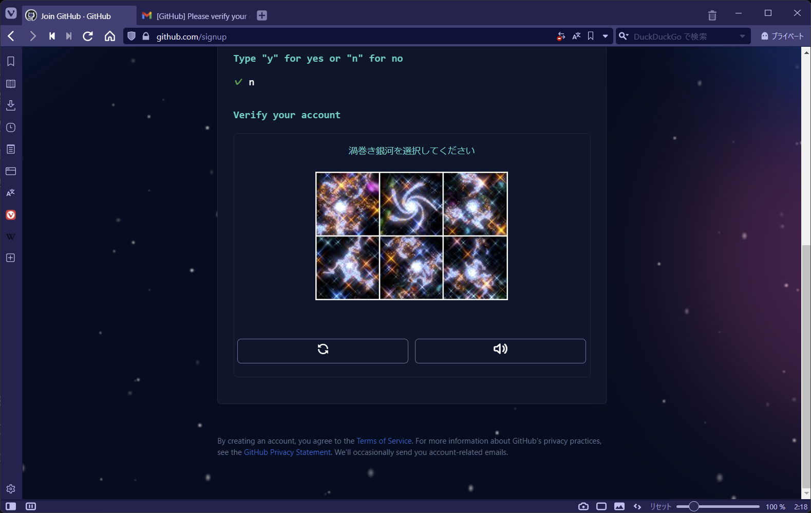
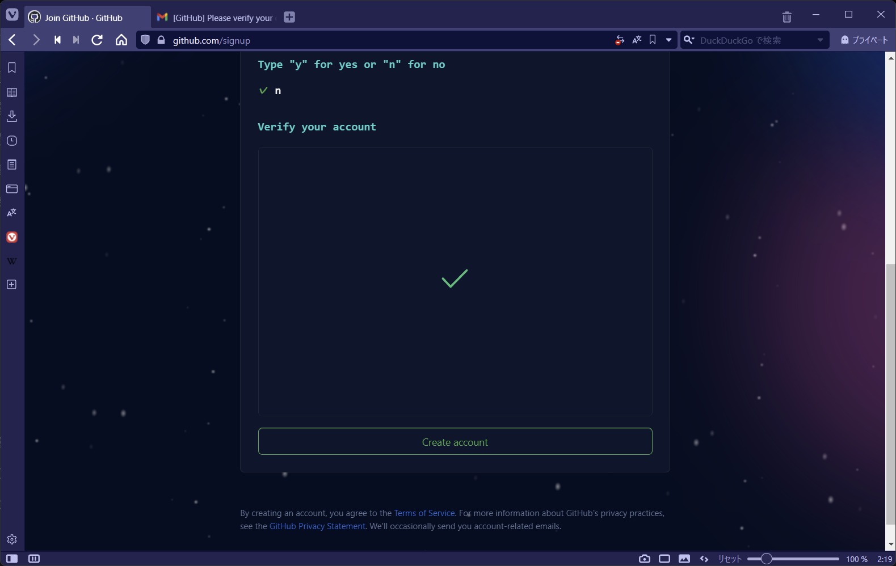
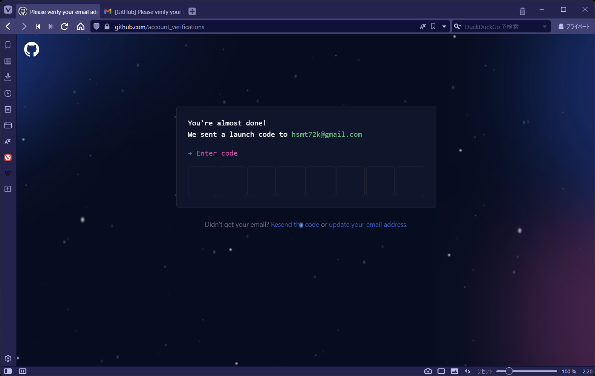

GitHub にアクセスする。

GitHub:  
https://github.com

Sign up ボタンをクリックする。  

Email を入力して、Continue ボタンをクリックする。  

パスワードを入力して、Continue ボタンをクリックする。

Username を入力して、Continue ボタンをクリックする。

お知らせメールを受け取るかどうかを入力して、Continue ボタンをクリックする。

渦巻き銀河の画像を選択する。

Create account ボタンをクリックする。

登録したメールアドレスに届いているコード番号を入力する。

